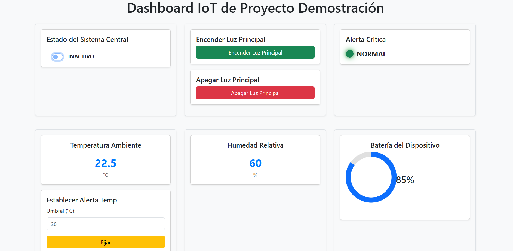

**iotRENDER** is a lightweight framework for creating modular and configurable web dashboards, designed for real-time monitoring and control of IoT projects based on microcontrollers (such as ESP32/ESP8266) through WebSocket communication. It allows users to fully define the user interface (UI) and interaction logic using JSON files, making customization and local deployment simple.

---

## 🌟 Key Features

*   **Real-Time Web Dashboard:** Bidirectional and persistent communication with IoT devices via WebSockets.  
*   **Modular and Configurable:** Build and modify your dashboard by defining the structure of rows, columns, and widgets in JSON files.  
*   **Extensible Widget Management:** A set of predefined widgets (buttons, sliders, LEDs, numeric displays, time-series charts) plus the ability to add your own custom widgets.  
*   **Robust Synchronization:** Widgets reflect the actual hardware state upon connection and handle command confirmation/rollback.  
*   **Modal Dashboards:** Simplify complex interfaces by nesting secondary dashboards inside modals for better organization.  
*   **Standard Technologies:** Built with HTML, CSS (Bootstrap 5), and vanilla JavaScript (with ApexCharts for charting).  
*   **Easy to Prototype:** Ideal for hobby projects, learning, and rapid prototyping without relying on cloud services.  

---

## 🛠️ Technologies Used

*   HTML5, CSS3, JavaScript (Vanilla JS)  
*   [Bootstrap 5.3.x](https://getbootstrap.com/docs/5.3/) for responsive styles and components.  
*   [ApexCharts.js](https://apexcharts.com/) for real-time chart visualization.  

---

## 🚀 Getting Started

Follow [these steps](./docs/EN/index.md) to set up your iotRENDER dashboard.  
